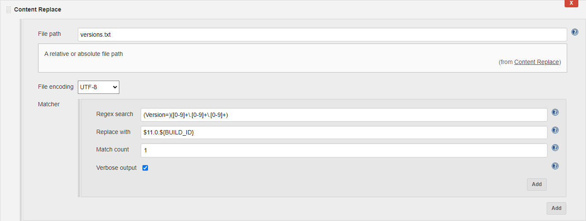

Content-replace plugin for Jenkins
=========================

[](https://plugins.jenkins.io/content-replace)
[](https://github.com/jenkinsci/content-replace/releases/latest)
[](https://plugins.jenkins.io/content-replace)
[](https://ci.jenkins.io/job/Plugins/job/content-replace-plugin/job/master/)


A plugin for Jenkins allows you to replace file content with regex
expressions.

  

## Features

-   Regex expression for search. e.g.
    (Version=)(\[0-9\]+\\.\[0-9\]+\\.\[0-9\]+)
-   You can use variables enclosed in ${}  

## Requirements

### Jenkins

Jenkins [version 2.204.6](https://jenkins.io/changelog#v2.204.6) or newer is
required.

  

#### Freestyle job configuration



#### Pipeline job configuration
```
contentReplace(
  configs: [
    fileContentReplaceConfig(
      configs: [
        fileContentReplaceItemConfig(
          search: '(Version=)([0-9]+\\.[0-9]+\\.[0-9]+)',
          replace: '$11.0.${BUILD_ID}',
          matchCount: 1,
          verbose: false,
        )
      ],
      fileEncoding: 'UTF-8',
       'versions.txt'
    )
  ]
)
```

## Changelog
### Version 1.7.0 (Feb 04, 2022)

-   Add, support verbose output control

### Version 1.6.0 (Dec 19, 2020)

-   Update the required version of Jenkins to v2.204.6

### Version 1.5.0 (Jan 19, 2020)

-   Add, support filepath of Ant path style

### Version 1.4.0 (Jan 09, 2020)

-   Fixed, contentReplace does not appear in the Snippet Generator

### Version 1.3.0 (Dec 07, 2019)

-   enables RegEx multiline mode
-   print replace lines info
-   beautify log

### Version 1.2.0 (Nov 23, 2019)

-   Move docs to GitHub

### Version 1.1.0 (Nov 18, 2019)

-   New, make failure immediately

### Version 1.0.10 (Aug 20, 2019)

-   Fixed, match count

### Version 1.0.8 (Aug 09, 2019)

-   Fixed, close InputStream after read the file‘s content

### Version 1.0.7 (June 21, 2019)

-   Fixed, matchCount not to be reset to 1 When editing the
    configuration file again

### Version 1.0.5 (Apr 07, 2019)

-   Fixed, support windows slave, linux master

### Version 1.0.4 (Feb 21, 2019)

-   Fixed, support for absolute path file
-   Fixed, matchCount not to be reset to 1 When editing the
    configuration file again

### Version 1.0.3 (Feb 19, 2019)

-   "File path" can be configured using variables

### Version 1.0.2 (Oct 26, 2018)

-   Add "Match count" config

### Version 1.0.1 (Aug 22, 2018)

-   Simply replace the contents of the specified encoded file
